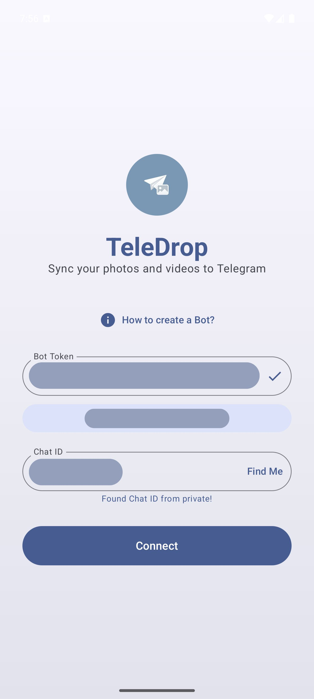
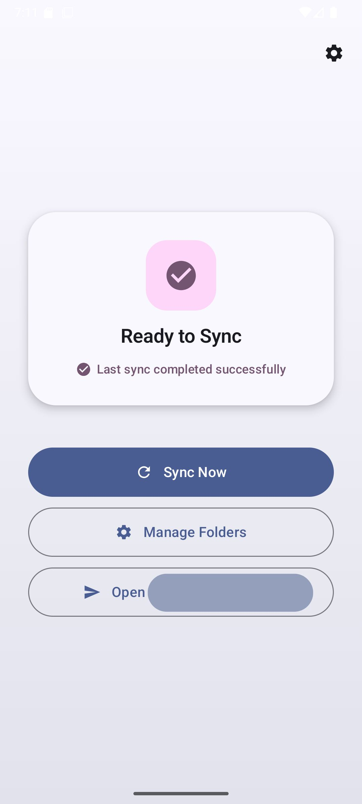
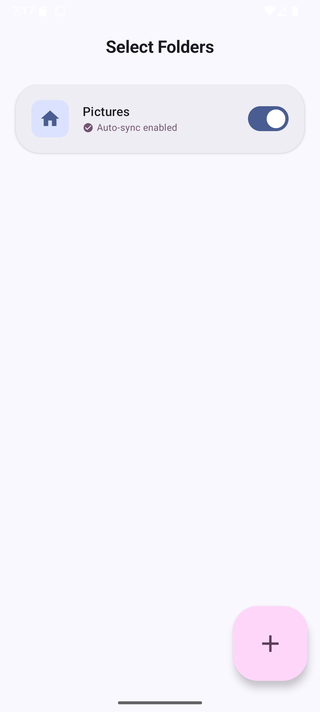
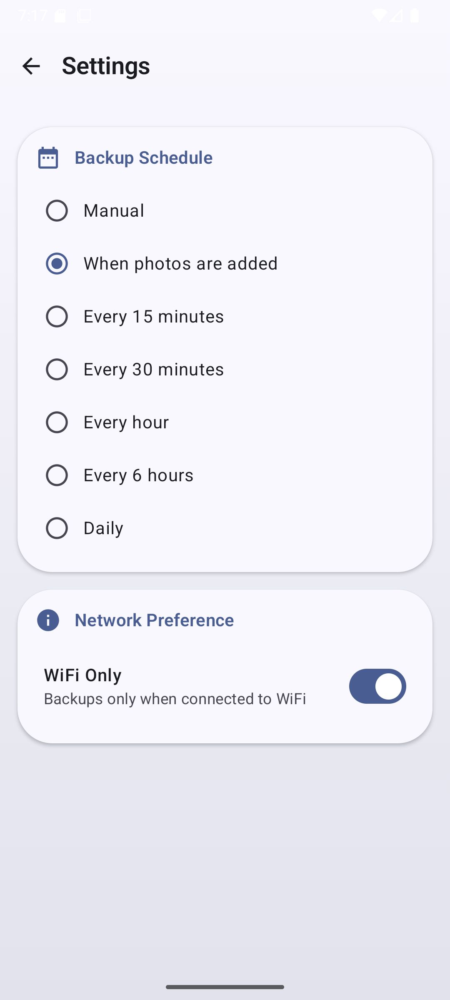

# TeleDrop

TeleDrop is an Android application designed to synchronize photos and videos to a Telegram chat or channel. By utilizing Telegram Bots, the application provides a method for media backup and storage directly from an Android device to the Telegram cloud.

## Features

*   **Telegram Integration**: Connects to specific Telegram accounts via a user-created Bot. Supports sending to **Forum Topics** in supergroups for organized device management.
*   **Smart Device Registration**: Automatically creates a dedicated forum topic for each device (in supported groups) and sends a detailed registration alert including:
    *   Device Name & OS Version
    *   IP Address & Location (with clickable **Google Maps** link)
    *   Registration Timestamp
*   **Visual Experience**:
    *   **Material 3 Design**: Modern, consistent UI with dynamic colors.
    *   **Expressive Motion**: Custom animations for smooth transitions, staggered list entrances, and tactile feedback.
    *   **Interactive Components**: Pulsing indicators, animated buttons, and responsive list items.
*   **Flexible Backup Scheduling**:
    *   **Instant Sync**: "Whan photos are added" option for immediate backup.
    *   **Periodic Sync**: Intervals from 15 minutes to daily.
    *   **Manual**: On-demand sync control.
*   **Smart Folder Management**:
    *   **Auto-detection**: Automatically finds and categorizes camera, download, and screenshot folders.
    *   **Granular Control**: Toggle auto-sync for specific folders.
    *   **Custom Folders**: Add any directory on your device to the backup list.
*   **Network Control**: "WiFi Only" mode to prevent mobile data usage.
*   **Background Processing**: Robust `WorkManager` implementation ensuring reliable uploads even when the app is closed.
*   **Quick Access**:
    *   **Quick Settings Tile**: Toggle sync from the notification shade.
    *   **Home Screen Widget**: Start sync directly from your launcher.

## Screenshots

| Setup Screen | Home Screen |
|:---:|:---:|
|  |  |
| **Folder Selection** | **Settings** |
|  |  |

## Technical Stack

*   **Language**: Kotlin
*   **UI Framework**: Jetpack Compose (Material 3)
*   **Networking**: Retrofit and OkHttp
*   **Concurrency**: Coroutines and WorkManager
*   **Persistence**: Room Database and DataStore
*   **Image Loading**: Coil

## Prerequisites

*   Android Device running Android 7.0 (API Level 24) or higher.
*   A valid Telegram account.

## Installation and Setup

1.  **Build or Install**: obtain the APK by building from the source code or downloading a release version.
2.  **Bot Creation**:
    *   Locate **@BotFather** on Telegram.
    *   Execute the `/newbot` command.
    *   Follow the prompts to assign a name and a username to the bot.
    *   Securely note the generated **HTTP API Token**.
3.  **Configuration**:
    *   Launch TeleDrop.
    *   Input the **Bot Token** in the provided field.
    *   Initiate a conversation with the created bot on Telegram by sending `/start`.
    *   In the TeleDrop application, select **"Find Me"** to verify the connection and retrieve the Chat ID.
    *   Upon successful setup, a notification will be sent to your Telegram with device information. **Note:** If your group has Topics enabled, a new thread will be automatically created for this device.
4.  **Permissions**: Grant the requested media access permissions to enable file synchronization.

## Usage Guide

*   **Manual Synchronization**: Launch the application and select the "Connect" or Sync option.
*   **Settings**: Tap the gear icon (⚙️) in the top-right corner to access:
    *   **Backup Schedule**: Configure automatic backup frequency or enable instant sync when new photos are added.
    *   **Network Preference**: Toggle WiFi-only mode to prevent uploads over mobile data.
*   **Quick Settings Tile**: Access the notification shade, edit the active tiles, and add the **TeleDrop Sync** tile. This allows for immediate synchronization without opening the main application.
*   **Widget**: Add the **Sync Widget** to the home screen via the system's widget selection menu.

## Build Instructions

Building this project requires Android Studio Ladybug or a newer version.

1.  Clone the repository:
    ```bash
    git clone https://github.com/rrrainielll/TeleDrop.git
    ```
2.  Open the project directory in Android Studio.
3.  Sync Gradle project files.
4.  Execute the build or run command for the target emulator or device.


## Contributing

Contributions are permitted. Improvement suggestions or feature additions can be proposed via the issue tracker or pull requests.

1.  Fork the Project
2.  Create a Feature Branch
3.  Commit Changes
4.  Push to the Branch
5.  Open a Pull Request

## License

Distributed under the MIT License. Refer to the `LICENSE` file for details.
